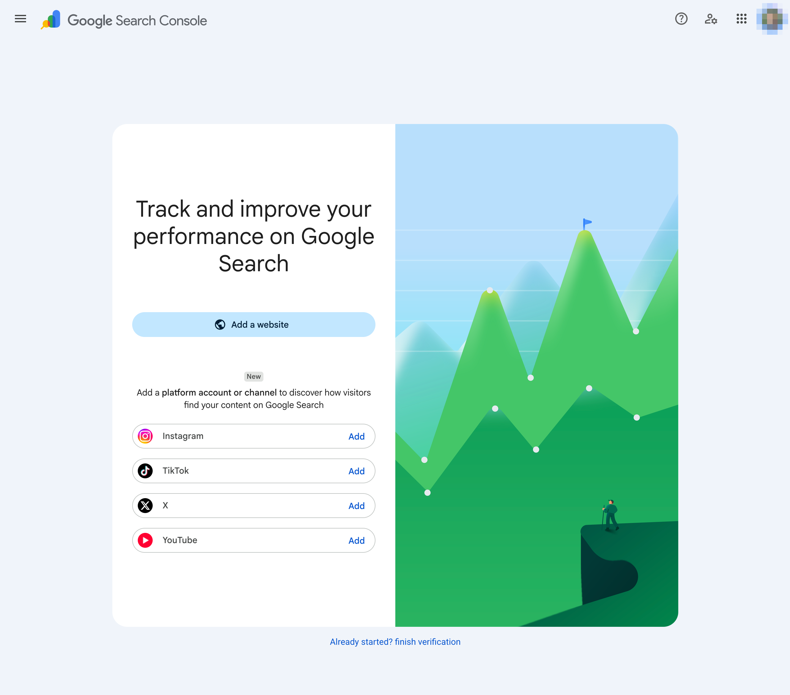
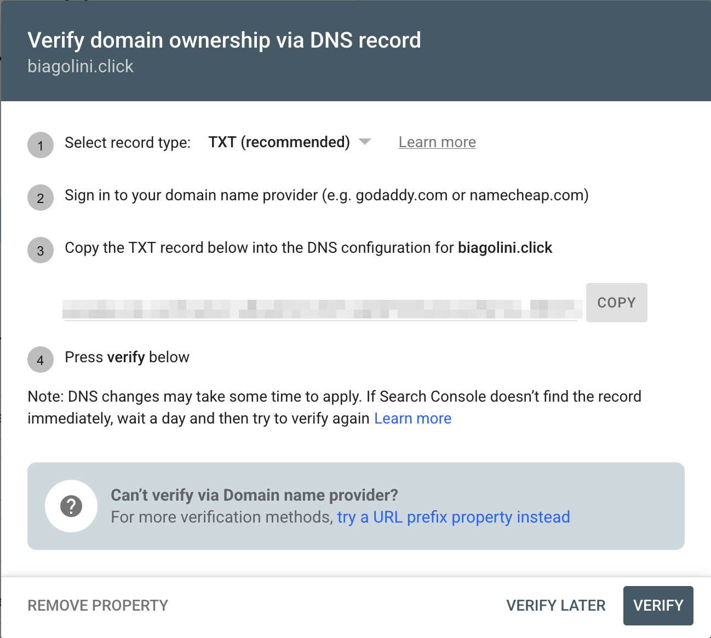
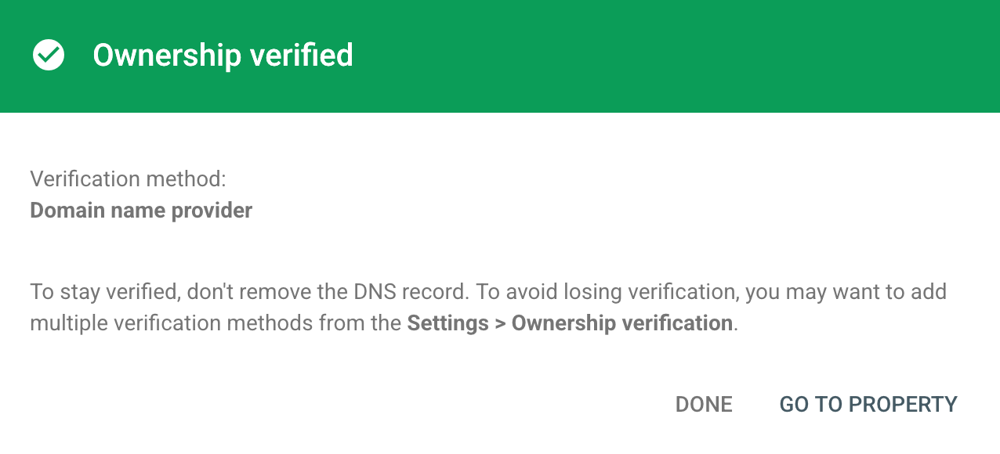

# Resolving the OAuth "Home Page Is Not Registered to You" Verification Error

This guide explains how to resolve the Google OAuth branding verification error where your app's home page domain is reported as not registered to you, when your DNS is hosted outside Google (for example, on Amazon Route 53). It is written for CertStudy but applies to any client-side app that uses Google Identity Services (GSI) OAuth 2.0.

---

## 1. The Error

During OAuth branding verification, the Google Cloud Console reports something like:

> Issues found from the previous verification attempt: The website of your home page URL "https://study.yourdomain.com" is not registered to you. Verify ownership of your home page, then wait 24 hours before retrying to allow our systems to update.

It then offers two paths:

- I have fixed the issues -> Request re-verification for your branding
- I believe the issues found are incorrect -> Request additional review

---

## 2. What Google Actually Requires

According to the official documentation ([App Homepage requirements](https://support.google.com/cloud/answer/13807376)), your app home page must be "hosted on a verified domain you own". For the specific finding "The website you provided as your homepage is not registered to you", the recommended remediation (Option 1) is to verify ownership of the home page domain, following the [Search Console site ownership verification guide](https://support.google.com/webmasters/answer/9008080).

Key facts:

- Google is not checking your DNS directly. It requires you to prove domain ownership through Google Search Console.
- This has no cost. Google Search Console is free, and the verification only adds a DNS record to the zone you already control.
- You do not need to migrate DNS away from your current provider (for example, Amazon Route 53), and you do not need any paid Google Cloud resource.

---

## 3. Prerequisites

- A standard Google Account (ideally the same one used for the Google Cloud project).
- Access to your DNS provider's administration (for example, an Amazon Route 53 hosted zone for `yourdomain.com`).
- Your app already reachable at its home page URL (for example, `https://study.yourdomain.com`).

---

## 4. Solution: Verify Domain Ownership via DNS TXT Record

The Search Console "Domain name provider" method uses a TXT record and is the only method that verifies a Domain property. A verified root domain automatically verifies all of its subdomains.

### Step 4.1: Add a Property in Google Search Console

1. Open [Google Search Console](https://search.google.com/search-console) (free).
2. Add a new property. Choose one of:
   - Domain property `yourdomain.com` (recommended): verifies the root domain and all subdomains, including `study.yourdomain.com`, across both HTTP and HTTPS.
   - URL-prefix property `https://study.yourdomain.com`: verifies only that specific subdomain.
3. Search Console generates a unique TXT value in the format `google-site-verification=XXXXXXXXXXXXXXXX`.



### Step 4.2: Create the TXT Record at Your DNS Provider

Add the provided TXT value to your DNS zone:

- For a Domain property `yourdomain.com`, place the TXT record at the zone apex. In Route 53 this means a record with name `yourdomain.com` (host `@`).
- For a URL-prefix property on a subdomain, place the TXT record at `study.yourdomain.com`.
- Leave the value exactly as provided by Search Console, wrapped in quotes if your provider requires it.

Example using the AWS CLI with Route 53 (replace the placeholders):

```bash
aws route53 change-resource-record-sets \
  --hosted-zone-id <your-hosted-zone-id> \
  --profile <your-aws-profile> \
  --change-batch '{
    "Comment": "Google Search Console domain ownership verification",
    "Changes": [
      {
        "Action": "CREATE",
        "ResourceRecordSet": {
          "Name": "yourdomain.com.",
          "Type": "TXT",
          "TTL": 300,
          "ResourceRecords": [
            { "Value": "\"google-site-verification=XXXXXXXXXXXXXXXX\"" }
          ]
        }
      }
    ]
  }'
```

Note: if a TXT record already exists at the apex (for example, an SPF record), add the verification string as an additional value on the same record set rather than overwriting the existing one.

The Search Console dialog presents the TXT record to copy. The record type is TXT (recommended), and you paste the value into your DNS provider's zone rather than the example providers Google lists.



### Step 4.3: Verify and Confirm Propagation

1. Confirm the record is being served. You can use `dig`:

   ```bash
   dig +short TXT yourdomain.com
   ```

   Or the [Google Admin Toolbox (Dig)](https://toolbox.googleapps.com/apps/dig/#TXT/).
2. In Search Console, click Verify. Manually added records can take from a few minutes up to two or three days to propagate, though managed DNS providers are usually fast.

Once the record is detected, Search Console confirms the domain with an "Ownership verified" screen, listing the verification method as Domain name provider.



### Step 4.4: Re-submit OAuth Branding Verification

1. Return to the OAuth consent screen in the Google Cloud Console.
2. Select "I have fixed the issues" and choose "Request re-verification for your branding".
3. If you received a verification email from Google, reply to it to confirm ownership as instructed in the App Homepage documentation.

Important: Do not remove the TXT record after verification succeeds. Search Console periodically re-checks it, and removing it revokes your verification.

---

## 5. Other Home Page Requirements to Check First

The same App Homepage documentation lists additional requirements that can also block branding verification. Confirm these before re-submitting, since each retry may require waiting 24 hours:

- The home page must describe the app's functionality and purpose, and must be visible without requiring login.
- The home page must contain a visible link to your privacy policy, and that link must match the one configured on the OAuth consent screen.
- The home page URL must be static and must not redirect to a different domain. The URL configured on the consent screen must match exactly the URL that opens in the browser (watch for HTTP to a different host redirects).
- Do not host the home page or privacy policy on a third-party platform where subdomain ownership cannot be verified (for example, Google Sites, Facebook, Instagram, X/Twitter).

---

## 6. Summary

- The error means Google needs proof of domain ownership, not a DNS change to Google.
- Verify the domain in Google Search Console (free) using a DNS TXT record in your existing DNS provider.
- Prefer a Domain property on the root domain so all subdomains are covered.
- Keep the TXT record in place permanently.
- Re-check the other home page requirements, then re-submit branding verification.

---

## 7. References

- [App Homepage requirements (Google Cloud Help)](https://support.google.com/cloud/answer/13807376)
- [Verify your site ownership (Google Search Console Help)](https://support.google.com/webmasters/answer/9008080)
- [OAuth production readiness policy compliance](https://developers.google.com/identity/protocols/oauth2/production-readiness/policy-compliance#host-homepage-production-apps)
